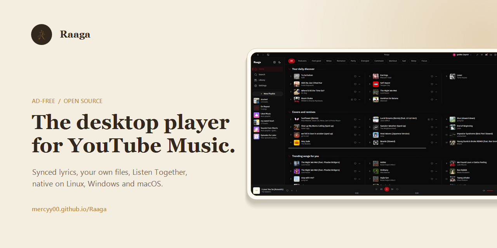

<div align="center">



# Raaga

**A native desktop YouTube Music client. Rust + Tauri, ad-free, no Electron.**

<p align="center">
  <a href="https://github.com/Mercyy00/Raaga/releases/latest"></a>
  <a href="https://github.com/Mercyy00/Raaga/releases/latest"></a>
  
  <a href="https://mercyy00.github.io/Raaga/"></a>
  <br>
  
  
  
  
  
</p>

**Raaga** talks directly to YouTube's internal API and plays audio through libmpv: no bundled
browser runtime, no backend server, no ads in the audio. It started as a desktop rebuild of the
playback engine behind [Metrolist](https://github.com/mostafaalagamy/Metrolist), an Android
YouTube Music client, and grew from there.

</div>

---

## Features

- **Ad-free playback**: streams come straight from YouTube's API, ads never do
- **Search & browse**: songs, albums, artists, playlists and the YTM home feed, with results previewing as you type
- **Sign in** with your YouTube Music account: in-app Google login or cookie-paste, several accounts at once with switching between them
- **Your library**: playlists, liked songs, saved albums and artists, your uploads, and write actions (like, add to playlist, create/edit/delete playlists including cover art, subscribe, save to library)
- **History**: everything you have played, in YouTube Music's own day buckets
- **Gapless playback** with loudness normalization, powered by libmpv
- **Queue** with radio/automix continuation, drag to reorder, restored across restarts
- **Synced lyrics**: side panel with auto-scroll and click-to-jump, word by word where the source has the timings, with translations under each line
- **Music videos**: optional, the video plays where the artwork sits, with the same gapless audio behind it
- **Mini Player and theater mode**: shrink to a strip that keeps playing, or go fullscreen with cover and lyrics side by side
- **Local Music**: play your own files, with all metadata still intact
- **Last.fm scrobbling**: connect once from the title bar, every play is scrobbled
- **Discord Rich Presence**: artwork, live progress bar, one click to toggle
- **OS media keys** and now-playing integration (MPRIS on Linux, SMTC on Windows, plus playback buttons on the Windows taskbar preview)
- **System tray**: close the window, keep the music; play/pause and skip from the tray, optional start-on-login
- **Listen Together**: synced listening rooms over a small self-hosted relay
- **Keyboard and mouse**: `Ctrl+K` searches from anywhere, `Ctrl+H` lists every shortcut, right-click menus throughout, `Ctrl` and the wheel zooms the interface
- **Six languages**: English, Spanish, French, Turkish, Brazilian Portuguese and Indonesian, with more in progress
- **Self-updating builds** (AppImage on Linux, setup.exe on Windows, .app on macOS)
- **Make it yours**: accent palettes, custom colors, your own fonts, corner roundness, a custom app icon, and an adaptive theme that recolors the app from the playing cover

---

## Screenshots

<table>
  <tr>
    <td></td>
    <td></td>
  </tr>
  <tr>
    <td></td>
    <td></td>
  </tr>
</table>

---

<h2 align="center">Download & Install</h2>

<p align="center">
  <a href="https://github.com/Mercyy00/Raaga/releases/latest">
    
  </a>
</p>

| Platform | File | Notes |
|---|---|---|
| Windows | `-setup.exe` | Self-updating |
| Windows | `.msi` | Plain installer, no auto-update |
| Linux | `.AppImage` | Self-updating, libmpv bundled. Needs glibc 2.39+ (Ubuntu 24.04+, Debian 13+, Fedora 40+) |
| Linux (Ubuntu/Debian) | `.deb` | No self-update. Needs Ubuntu 24.04+ / Debian 13+; apt pulls libmpv and webkit2gtk in for you |
| Linux (Fedora/RHEL) | `.rpm` | Needs `mpv-libs` installed (`sudo dnf install mpv-libs`). No updates, redownload each release |
| macOS (Apple Silicon) | `.dmg` | Self-updating. Unsigned, so the first launch needs `xattr -dr com.apple.quarantine /Applications/raaga.app` |
| macOS (Intel) | none | Build from source, see [docs/BUILD-PLATFORMS.md](docs/BUILD-PLATFORMS.md) |

---

## Scrobbling & Discord

Both live in the title bar, next to the window controls.

- **Last.fm**: click the Last.fm mark, approve Raaga in the browser tab that
  opens, and you're connected for good. Tracks scrobble at the halfway point (or
  four minutes, whichever comes first), which is Last.fm's own rule. Click again
  to see the account or disconnect.
- **Discord**: click the Discord mark to toggle Rich Presence. Green dot means
  it's live. The card shows the track, artist, album art, and a progress bar, and
  it disappears when you pause.

Building from source? Last.fm needs your own API credentials, and they are not in
the repo. Get a key at [last.fm/api/account/create](https://www.last.fm/api/account/create)
and put it in `src-tauri/lastfm.keys`:

```
RAAGA_LASTFM_API_KEY=your_key
RAAGA_LASTFM_API_SECRET=your_secret
```

Without that file everything else still builds and runs; the Last.fm button just
reports that it isn't configured.

---

## Lyrics

Open the panel with the microphone button in the player bar, next to the queue
button. It takes the same side of the window as the queue, so opening one closes
the other.

Lyrics come from [Boidu](https://boidu.dev) first, then
[LRCLIB](https://lrclib.net), then YouTube Music's own timed lyrics, then
Netease, QQ Music and Kugou, falling back to plain un-timed text when nobody has
a synced version. Matching is keyed on the track's exact length, because popular
songs exist as several cuts and the wrong one drifts a few seconds out. Results
are cached locally, so replaying a track is instant.

Boidu is the only source with per-word timings, which is what lets a line
highlight word by word as it's sung. It goes first for that reason, which also
means it is asked about every track you play. Turn it off in **Settings ->
Playback -> Word-by-word lyrics** and the other sources still provide
line-by-line lyrics. Netease additionally supplies translations, shown under
each line where it has them.

Note that YouTube Music's lyrics are licensed per region and are missing
entirely in some countries. Where that's the case, LRCLIB does all the work.

---

## Listen Together

Synced listening with friends. Everyone streams their own audio from YouTube;
the room only relays play/pause, seeks, track changes and the queue. One person
hosts the relay:

```bash
cargo run -p sync-server        # plain WebSocket on 0.0.0.0:8080
```

Front it with something that terminates TLS (Tailscale Funnel, Cloudflare
Tunnel), then paste the `wss://` URL into the Listen Together panel in the app.
Rooms have join codes and the host approves every join and every track
suggestion.

---

## Translations

English, Spanish, French, Turkish, Brazilian Portuguese and Indonesian ship in
the app today, with more in progress.

Translations live as plain JSON catalogs under `ui/src/lib/locales/`. To add or
fix one, edit the matching file (`en.json` is the source of truth) and open a
pull request. Anything untranslated falls back to English in the app, so partial
work is safe to submit. Switching a finished language on in the picker takes a
small code change too, see [CONTRIBUTING.md](CONTRIBUTING.md#translations).

---

## Building from Source

Fedora:

```bash
sudo dnf install mpv-libs mpv-libs-devel webkit2gtk4.1-devel \
  gcc gcc-c++ make openssl-devel librsvg2-devel
cd ui && pnpm install && cd ..
cargo tauri build
```

Windows and macOS instructions live in [docs/BUILD-PLATFORMS.md](docs/BUILD-PLATFORMS.md).

---

## How It Works, Briefly

- A pure Rust crate speaks YouTube's InnerTube API, impersonating several
  official client identities and falling back between them when one fails.
- YouTube's stream URLs are protected by obfuscated JavaScript (the signature
  cipher and the `n` parameter) and by BotGuard attestation. Raaga runs that
  JavaScript where it expects to run, in a real webview, hidden, and never lets
  any of it touch the UI process.
- Audio goes through libmpv: gapless transitions, an on-disk cache, and
  loudness normalization from YouTube's own metadata.
- The UI is a SvelteKit SPA that only ever talks to the Rust core. It never
  contacts YouTube itself.

---

## Star History

<a href="https://www.star-history.com/?repos=Mercyy00%2FRaaga&type=date&legend=top-left">
 <picture>
   <source media="(prefers-color-scheme: dark)" srcset="https://api.star-history.com/chart?repos=Mercyy00/Raaga&type=date&theme=dark&legend=top-left" />
   <source media="(prefers-color-scheme: light)" srcset="https://api.star-history.com/chart?repos=Mercyy00/Raaga&type=date&legend=top-left" />
   
 </picture>
</a>

---

## Disclaimer

This project is not affiliated with, funded, authorized, endorsed by, or in
any way associated with YouTube, Google LLC, or any of their affiliates and
subsidiaries.

All trademarks, service marks, and intellectual property rights referenced in
this project belong to their respective owners.

---

## License

[GPL-3.0](LICENSE)
